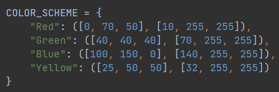

# Лабораторная работа 1

## Цель работы:
Научиться реализовывать один из простых алгоритмов обработки 
изображений.
## Задание:
1. Реализовать программу согласно варианту задания. Базовый алгоритм, 
используемый в программе, необходимо реализовать в 3 вариантах: с 
использованием встроенных функций какой-либо библиотеки (OpenCV, 
PIL и др.) и нативно на Python + |с использованием Numba или C++|.
2. Сравнить быстродействие реализованных вариантов.
3. Сделать отчёт в виде readme на GitHub, там же должен быть выложен 
исходный код.

## Описание разработанной системы
Было выбрано 3 способа определения доминирующего цвета:
1) Используя библиотеку PIL
2) Используя numpy
3) Используя C++

Было выбрано 4 искомых цвета: красный, жёлтый, зелёный, голубой.
Для каждого способа были заданы границы цветов:

PIL/numpy

C++

### PIL
1) Сжимаем часть видеопотока до 1 пикселя
2) Проверяем, попадает ли этот пиксель в границы цветов
3) Выводим найденный цвет

### numpy/C++
1) В искомой области находим маску для каждого цвета считая количество пикселей, которое попадает в границы цвета
2) Выводим цвет с наибольшим размером маски

## Результаты работы и тестирования системы
Сравнение быстродействия (секунды):
* numpy: 0.0029 с.
* PIL: 0.00085 с.
* C++: 0.0013 c.

## Выводы по работе
По метрике быстродействия лучше всего себя показала библиотека PIL, ориентированная на работу с графикой. 
Среди нативных методов быстрее оказался C++, работая в среднем в 2 раза быстрее numpy.

## Использованные источники
- https://en.wikipedia.org/wiki/HSL_and_HSV
- https://pillow.readthedocs.io/en/stable/
