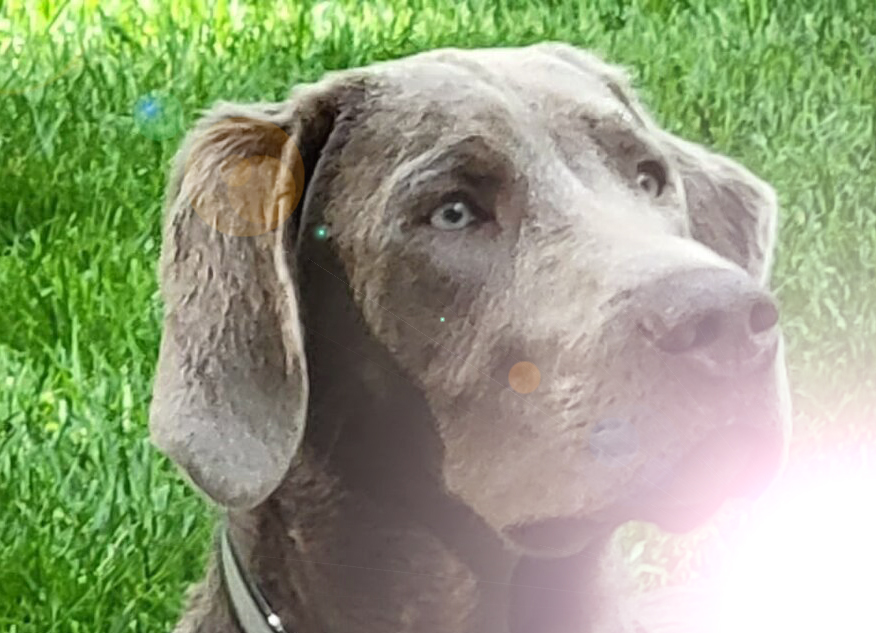

# Лабораторная работа 2

## Цель работы:
Научиться создавать простые системы классификации изображений на 
основе сверточных нейронных сетей.
## Задание:
1. Реализовать систему классификации согласно описанию, используя не 
менее трех различных архитектур нейронной сети.
2. Сравнить качество работы, скорость и количество потребляемой памяти 
для каждой архитектуры.
3. Сделать отчёт в виде readme на GitHub, там же должен быть выложен 
исходный код.

## Теоретическая база
Template matching — метод, основанный на нахождении места на изображении, наиболее похожем на шаблон. “Похожесть” изображения задается определенной метрикой. То есть, шаблон "накладывается" на изображение, и считается расхождение между изображением и и шаблоном. Положение шаблона, при котором это расхождение будет минимальным, и будет означать место искомого объекта.

В качестве метрики можно использовать разные варианты, например — сумма квадратов разниц между шаблоном и картинкой (sum of squared differences, SSD), или использовать кросс-корреляцию (cross-correlation, CCORR).

Для поиска используются разные метрики расхождений:
 - CV_TM_SQDIFF — сумма квадратов разниц значений пикселей
 - CV_TM_SQDIFF_NORMED — сумма квадрат разниц цветов, отнормированная в диапазон 0..1.
 - CV_TM_CCORR — сумма поэлементных произведений шаблона и сегмента картинки
 - CV_TM_CCORR_NORMED — сумма поэлементных произведений, отнормированное в диапазон -1..1.
 - CV_TM_CCOEFF — кросс-коррелация изображений без среднего
 - CV_TM_CCOEFF_NORMED — кросс-корреляция между изображениями без среднего, отнормированная в -1..1 (корреляция Пирсона)

## Описание разработанной системы
Для каждого изображения из набора был вырезан фрагмент сцены и преобразован одним из нижеописанных способов:
* Обрезка

    

* Растягивание

    

* Блик

    

* Поворот

    

* Волна

    

* Зерно

    

* Смена цветового тона

    

* Уменьшенная насыщенность и яркость

    

* Фото экрана сбоку

    

* Фото экрана сверху

    

После этого для каждого изображения ищется фрагмент с помощью SIFT и template matching. Для template matching 
изображение дополнительно преобразовывалось в монохромное.

## Результаты работы и тестирования системы
В целом, алгоритм поиска ключевых точек (в данном случае SIFT) работает стабильнее. При добавлении блика на изображение, 
повороте изображения и фотографировании экрана template matching неверно определяет границы искомого объекта.

Верно найденных шаблонов:
* Template matching - 6/10
* SIFT - 9/10

## Использованные источники
- https://docs.opencv.org/4.x/d4/dc6/tutorial_py_template_matching.html
- https://habr.com/ru/company/joom/blog/445354/
- https://www.allaboutcircuits.com/technical-articles/understanding-color-models-used-in-digital-image-processing/