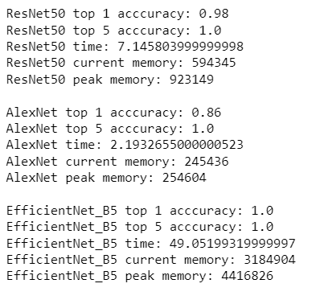

# Лабораторная работа 3

## Цель работы:
Исследовать простейшие алгоритмы детектирования объектов на 
изображении.
## Задание:
1. Реализовать программу согласно описанию. Можно использовать языки 
C++ или Python и любые библиотеки, при этом необходимо чтобы вся
задача не решалась только с помощью одной встроенной функции 
(например, lib.detect_template(image, template).
2. Сравнить качество работы двух вариантов реализации по точности 
детектирования.
3. Сделать отчёт в виде readme на GitHub, там же должен быть выложен 
исходный код.

## Теоретическая база
Классификация изображений – это процесс извлечения классов информации из многоканального растрового изображения. 
Растр, полученный в результате классификации изображения, можно использовать для создания тематических карт. В зависимости от характера взаимодействия аналитика с компьютером в процессе классификации, различают два типа классификации изображений: классификацию с обучением и классификацию без обучения.

### Архитектуры используемых моделей
#### ResNet50

#### AlexNet

#### EfficientNet_B5

## Описание разработанной системы
В данной лабораторной работе исследовались 3 предобученные модели из torchvision.models: 
- ResNet50
- AlexNet 
- EfficientNet_B5

Каждая из моделей была обучена на ImageNet (использовал веса IMAGENET1K_V1) и была протестирована на датасете из
50 изображений.
Искомым классом был выбран Labrador retriever (ind. 208).

## Результаты работы и тестирования системы
В метрике top-1 accuracy лучше всех себя показал EfficientNet, далее ResNet50 и после него AlexNet.
В таком же порядке они расположились по метрикам времени обучения и потребляемой памяти.

В метрике top-5 accuracy все модели показали точность 100%.

## Использованные источники
- https://pytorch.org/vision/stable/models.html
- https://towardsdatascience.com/complete-architectural-details-of-all-efficientnet-models-5fd5b736142
- https://towardsdatascience.com/the-w3h-of-alexnet-vggnet-resnet-and-inception-7baaaecccc96